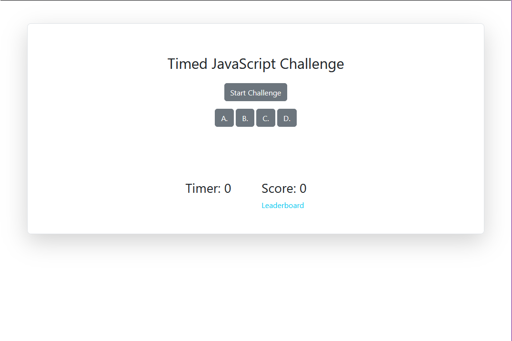

# Timed JavaScript Challenge

## Description

This application is a little timed JavaScript quiz. The user starts with 60 seconds to complete the quiz. Every correct answer adds to the score, and every wrong answer subtracts 10 seconds from the timer.

Below is a screenshot of the website and the link to it.

[Website Link](https://purplepeopleeated.github.io/timed-js-challenge/)

## Usage

Click on the Start Challenge button to being the quiz. Answer each question and view your score at the end!

The highest score you can get is 100.

## Credits

Articles Used:
- [MDN Docs](https://developer.mozilla.org/)
- [w3schools](https://www.w3schools.com/)